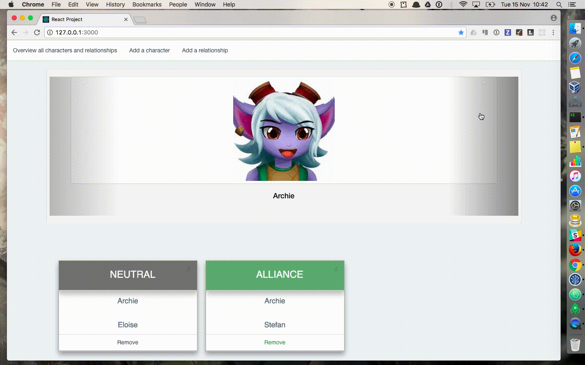

# react-project

###########################################################################################################################

## A simple app

The app consists of a simple REST API which handles the relationships between distinguished individuals with superpowers.

#### This app is for learning purpose only.

A character has the following attributes:

- A name.

- A set of relationships with other characters. Each relationship has also a state. This can be one of three possibilities: ALLIANCE, ARCHENEMY or NEUTRAL

###########################################################################################################################

## The Stack

- **Node** => JS server

If you want to upgrade Node to the new version V7.0.0 (latest release was on 25/10/2016):

`$> brew unlink node`

`$> brew install node`

More about Node: [CHANGELOG_V7](https://github.com/nodejs/node/blob/master/doc/changelogs/CHANGELOG_V7.md#7.0.0), [Discussion](https://news.ycombinator.com/item?id=12788926)

- **React** => the JS library used by Facebook or Instagram and which allows to manipulate the DOM elements on the Client side but also also to render the components on the server side (concept of **“Virtual DOM”**)

- **MongoDB** => NoSQL database

 -- Installation (under Mac OS >= Yosemite): `brew install mongodb`

 -- General information (Mac OS): `brew info mongo`

 -- Start server (Mac OS): `brew services start mongodb`  

- **npm** => package manager for Node JS modules

- **bower** => package manager for front end components

- **Gulp** => build system

I used **Robomongo** as a database management tool for MongoDB (overview - screenshots below):

 If you launch the daemon (`mongod`) and if your configuration is correct, you can query the data via the terminal:

###########################################################################################################################

### MongoDB: some common issues due to a lack of configuration

Here are some issues (when you launch `mongod` for the first time on your machine) and how to solve them:

- `exception in initAndListen: 29 Data directory data/db not found., terminating`

=> create the folder and give a proper access / rights for the daemon: `mkdir -p data/db`

- `Failed to obtain address information for the hostname ...: nodename nor servname provided, or not known`

=> add the host to the `hosts` file like below:

###########################################################################################################################

### Npm modules (non-exhaustive list)

- **Express** => Node web framework

- **Nodemon** => auto-refresh the server on code change

- **Mongoose** => MongoDB Original Design Manufacturer with validation and schema support.

- **mongoose-autoincrement-id** => manage the auto-incrementation of the index

- **babel** => compiler, React no longer uses JSXTransformer.js but babel.js (since React v0.14)

###########################################################################################################################

### Front end libraries (non-exhaustive list)

- **JQuery**

- **Bootstrap**

- **Magnific Popup**

- **Toastr**

### Image origin: internet.  This app is for learning purpose only.

###########################################################################################################################

## Run the code

`$> mongod  # launch daemon for MongoDB`

`$> npm install  # install Node JS modules ("dependencies" and "devDependencies") from the package.json file)`

`$> npm run watch  # run the app!`

Open your favorite browser (Chrome, Firefox or Safari) at http://127.0.0.1:3000/ (3000 has been chosen as the port by default)

###########################################################################################################################

## The tests

I didn't have enough time to write proper tests.

Here are some nice functions I would have used https://facebook.github.io/react/docs/test-utils.html

###########################################################################################################################

## License

##### This project is licensed under the GNU General Public License.

https://www.gnu.org/licenses/gpl-2.0.txt

###########################################################################################################################

## Acknowledgments

I picked and read this really nice tutorials in order to build my own app:

  http://sahatyalkabov.com/create-a-character-voting-app-using-react-nodejs-mongodb-and-socketio/

  https://ctheu.com/2015/02/09/a-journey-through-the-creation-of-an-app-with-node-mongodb-react-gulp/

  https://scotch.io/tutorials/learning-react-getting-started-and-concepts

Please feel free to send me your feedbacks or remarks about the code. Thanks!
